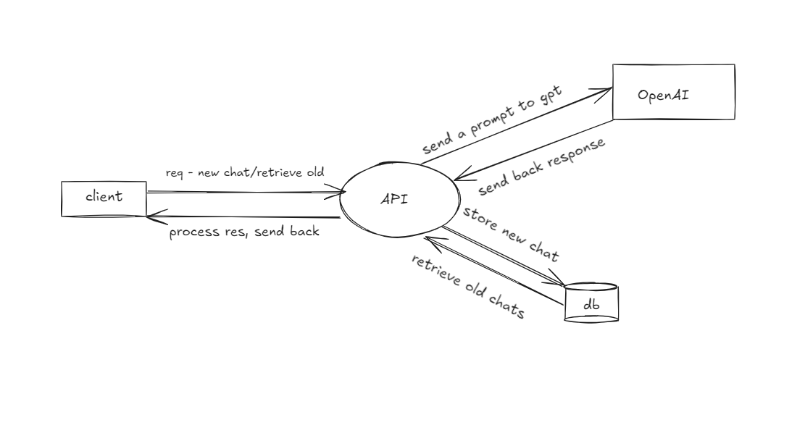

# Design
> This doc contains all information around the design. 

## Overall System

> Additional points, which I wanted to make but are out of scope of the current assignment.
> * Authentication is not in-scope but is a critical aspect.
> * Database is out of scope too but have done database design at the end.
> * Will be completing the assignment with Cohere, as I stated earlier too, don't have an OpenAI subscription.
> * Should ideally anonymise requests before sending to GPT, so added a layer to remove PII (personally identifiable information).

